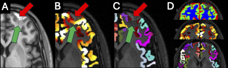

# ANTsNetCT-Cortical-Thickness-with-Contusion-Post-Processing
Post-processing script that utilizes contusion mask and tissue priors generated with ANTsNetCT. Automatically finds contusion mask in BIDS dir and applies contusion masking prior to cortical thickness estimation with ANTsPyNet/ANTsNetCT tools.

paper: Brennan D, Schneider ALC, Shinohara RT, Diaz-Arrastia R, Cook PA, Gee JC, Gugger JJ. Contusions bias cortical thickness estimates after traumatic brain injury: A TRACK-TBI study. Neuroimage Clin. 2026;50:104003. doi: 10.1016/j.nicl.2026.104003. Epub 2026 May 6. PMID: 42114207; PMCID: PMC13191617.
